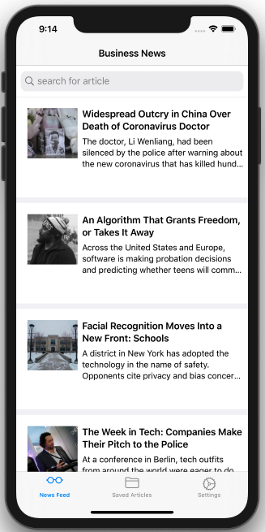

# NYTTopStories

App review to demonstrate the following: collection view, custom delegation, persistence using UserDefaults and Documents directory, setting up UI Programmatically, animaation and gestures.

- [x] Collection view 
- [x] Custom pogrammatic collection view cell
- [ ] User defaults 
- [ ] Search
- [x] Subclass UITabBarController
- [x] FileManager and documents directory 
- [x] Custom delegation 
- [x] Programmatic UI 
- [x] Segueing view controllers in code 
- [ ] Animations 
- [ ] Gestures
- [x] Unit test

## Running this project 

In order to run this project you will need an API key to access the New York Times Top Stories API. Once you've registered and acquired an API key, do the following: 

1. Clone this repo
2. Open the Xcode project and navigate to **Supporting Files** folder delete the Config.swift file and create a new Config.swift file
3. Open the newly created Config.swift file and enter the following code below: 

```swift 
struct Config {
  static let apiKey = "YOUR API KEY FOR THE NEW YORK TIMES TOP STORIES API GOES HERE"
}
```

4. Run the project 


